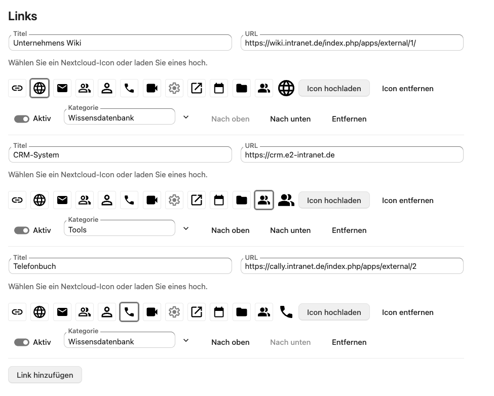

<!--
  SPDX-FileCopyrightText: 2026 André Wiesehoff
  SPDX-License-Identifier: AGPL-3.0-or-later
-->

# Company links

Admin-managed company links for the Nextcloud Dashboard and an All links page.



Nextcloud 33 to 35. PHP 8.2 to 8.5. The interface is in English and German.

## Install

Enable **Company links** under **Apps**, or from the server:

```sh
occ app:enable dashboard_links
```

For one group:

```sh
occ app:enable dashboard_links --groups staff
```

Enabling the app leaves existing dashboards unchanged. Each person adds the **Company links** tile under **Customize**.

To place the tile on the default layout for people who have not customized their dashboard:

```sh
occ config:app:set dashboard layout --value "recommendations,spreed,mail,calendar,dashboard_links"
```

## Configure

Open **Administration settings**, then **Company links**.

Each link needs a title and an https address. A category is optional. On the Dashboard and on All links, a category is the heading and the line under a link is the host. Save replaces the whole catalog, up to 200 links and 40 categories.

Remove the app with `occ app:remove dashboard_links`. That deletes the catalog and uploaded icons.

## Privacy

The app stores no accounts and sends no catalog data to the author. Opening a link sends the browser to the https address an administrator saved. The response sets `Referrer-Policy: no-referrer`. The destination can still see the IP address and usual browser headers. List those destinations in the instance privacy notice.

## Develop

```sh
composer install
composer test
npm ci
npm run lint
npm run build
```

The admin API is in [docs/api.md](docs/api.md). Publishing to the App Store is in [docs/publish.md](docs/publish.md).

## License

[AGPL-3.0-or-later](LICENSES/AGPL-3.0-or-later.txt).
